# Задание 1

1. Возьмите из [демонстрации к лекции готовый код](https://github.com/netology-code/ter-homeworks/tree/main/04/demonstration1) для создания ВМ с помощью remote-модуля.
2. Создайте одну ВМ, используя этот модуль. В файле cloud-init.yml необходимо использовать переменную для ssh-ключа вместо хардкода. Передайте ssh-ключ в функцию template_file в блоке vars ={} .
Воспользуйтесь [**примером**](https://grantorchard.com/dynamic-cloudinit-content-with-terraform-file-templates/). Обратите внимание, что ssh-authorized-keys принимает в себя список, а не строку.
3. Добавьте в файл cloud-init.yml установку nginx.
4. Предоставьте скриншот подключения к консоли и вывод команды ```sudo nginx -t```.

# Решение 1

Чтобы записать публичный ключ в машины через cloud-init файл:
1. Забираем текст файла в блоке template_file при помощи обязательного атрибута template:
   > template=file('./cloud-init.yaml')
2. Для передачи переменной в cloud-init.yaml в блоке template_file указывает:
   > vars{
       public_key=var.public_key
   }
3.  В файле cloud-init.yaml ссылаемся на переменную по имени:
    > ${public_key}

Чтобы запустить nginx:
1. Инсталлируем пакет nginx через packeges
2. Задачей runcmd включаем запуск при старте и стартуем nginx:
   > systemctl enable nginx
   > systemctl start nginx

**В результате получаем следующее решение:**
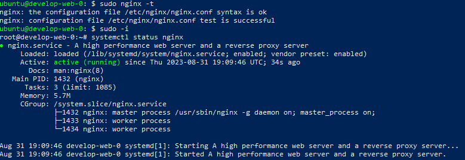

# Задание 2

1. Напишите локальный модуль vpc, который будет создавать 2 ресурса: **одну** сеть и **одну** подсеть в зоне, объявленной при вызове модуля, например: ```ru-central1-a```.
2. Вы должны передать в модуль переменные с названием сети, zone и v4_cidr_blocks.
3. Модуль должен возвращать в root module с помощью output информацию о yandex_vpc_subnet. Пришлите скриншот информации из terraform console о своем модуле. Пример: > module.vpc_dev  
4. Замените ресурсы yandex_vpc_network и yandex_vpc_subnet созданным модулем. Не забудьте передать необходимые параметры сети из модуля vpc в модуль с виртуальной машиной.
5. Откройте terraform console и предоставьте скриншот содержимого модуля. Пример: > module.vpc_dev.
6. Сгенерируйте документацию к модулю с помощью terraform-docs.    
 
Пример вызова

```
module "vpc_dev" {
  source       = "./vpc"
  env_name     = "develop"
  zone = "ru-central1-a"
  cidr = "10.0.1.0/24"
}
```

# Решение 2

## Информация о модуле vpc_dev

1. В папке modules создаем подпапку по имени модуля(vpc_dev)
2. В ней создаем:
   - основной файл **main.tf** с описанием провайдера и ресурсов
   - файл **variables.tf** с входными переменными env_name, zone и cidr_block
   - файл **outputs.tf** с выходными переменными **vpc_network** и **vpc_subnet**
3.  Подключаем модуль **vpc_dev**  в основном модуле используя следующий блок:
   > module "vpc_dev" {
      source="./modules/vpc_dev"
      zone=var.default_zone
      cidr_block=["10.0.1.0/24"]
      env_name  ="develop"
      }

В terraform concole имеем следующий вывод:

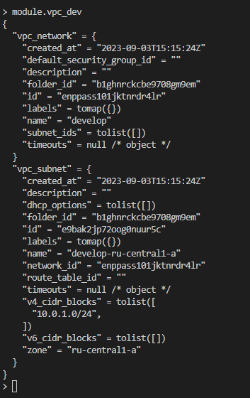

## Генерация документации

Для генерации документации используется модуль terraform-docs и команда:
> terraform-docs markdown table --output-file Readme.md ./modules/vpc_dev


# Задание 3
1. Выведите список ресурсов в стейте.
2. Полностью удалите из стейта модуль vpc.
3. Полностью удалите из стейта модуль vm.
4. Импортируйте всё обратно. Проверьте terraform plan. Изменений быть не должно.
Приложите список выполненных команд и скриншоты процессы.

# Решение 3

1. Решением является результат команды **terraform state list**
   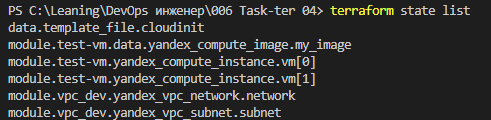
2. Решением является команда **terraform state rm module.vpc_dev**
   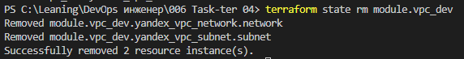
3. Решение является команда **terraform state rm module.test-vm**
   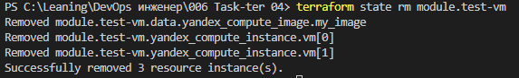
4. Решением является следующий набор команд:
   - terraform import module.vpc_dev.yandex_vpc_network.network enppass101jktnrdr4lr
  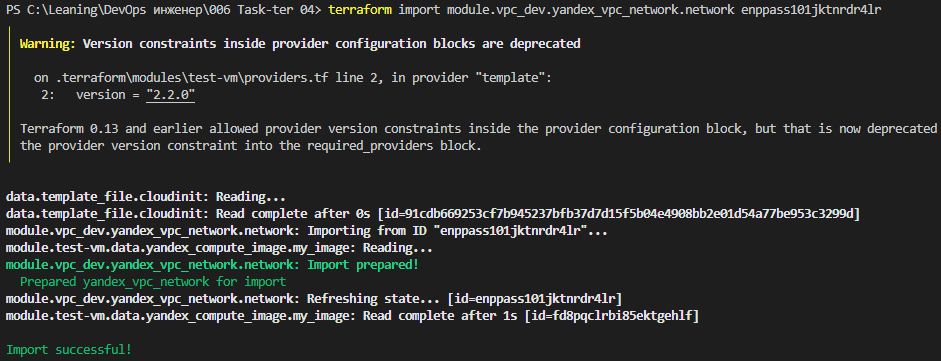
   - terraform import module.vpc_dev.yandex_vpc_subnet.subnet e9bak2jp72oog0nuur5c
  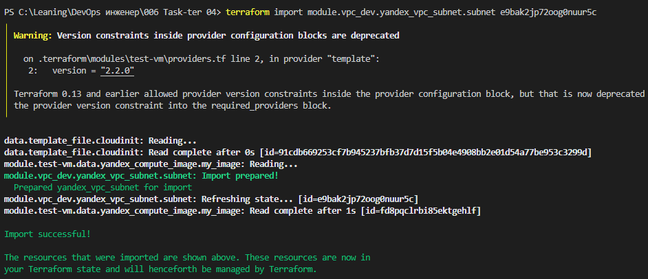
   - terraform import module.test-vm.yandex_compute_instance.vm[0] fhm5ouertrnslub0plr6
  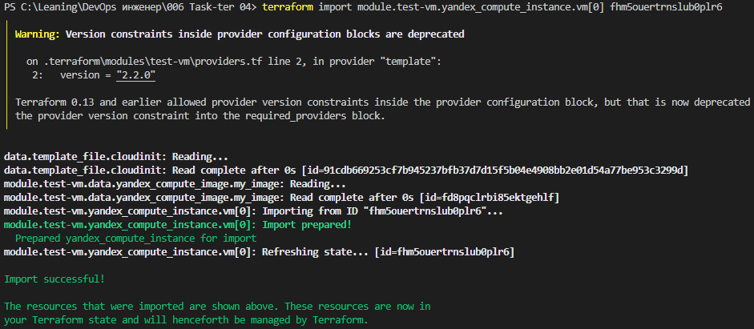
   - terraform import module.test-vm.yandex_compute_instance.vm[1] fhm6do5uod31lf2gb694
  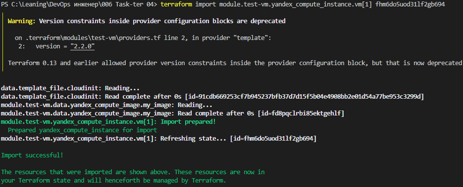

  В результате получаем идентичный стейт.

# Задание 4*

1. Измените модуль vpc так, чтобы он мог создать подсети во всех зонах доступности, переданных в переменной типа list(object) при вызове модуля.  
  
Пример вызова
```
module "vpc_prod" {
  source       = "./vpc"
  env_name     = "production"
  subnets = [
    { zone = "ru-central1-a", cidr = "10.0.1.0/24" },
    { zone = "ru-central1-b", cidr = "10.0.2.0/24" },
    { zone = "ru-central1-c", cidr = "10.0.3.0/24" },
  ]
}

module "vpc_dev" {
  source       = "./vpc"
  env_name     = "develop"
  subnets = [
    { zone = "ru-central1-a", cidr = "10.0.1.0/24" },
  ]
}
```

Предоставьте код, план выполнения, результат из консоли YC.

# Решение 4*

План исполнения:

1. Исходный код модуля vpc_prod находится по ссылке (ссылка)[modules/vpc_prod]
2. План выполнения привел к созданию 1 сети и 3 новых подсетей, а также автоматически обновились две ВМ из-за настройки allow_stopping_for_update
   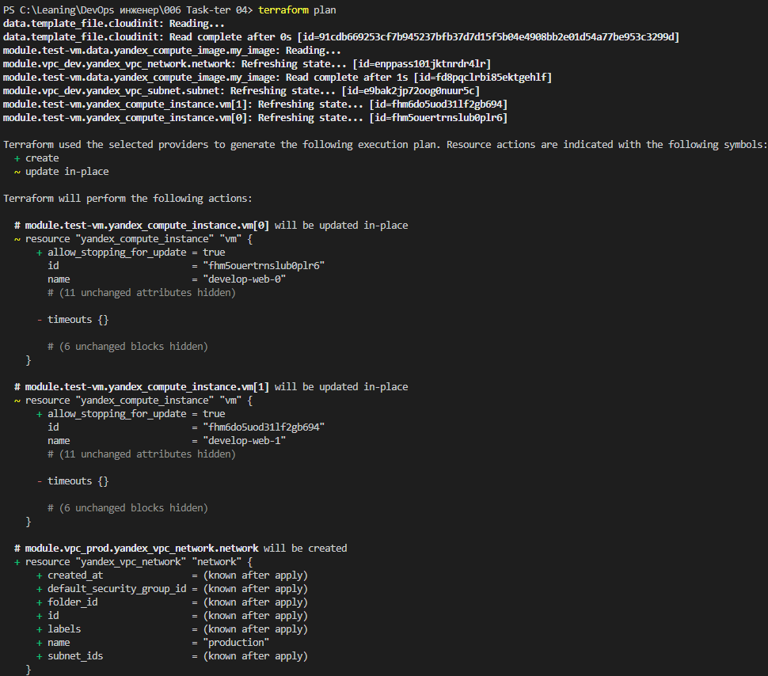
   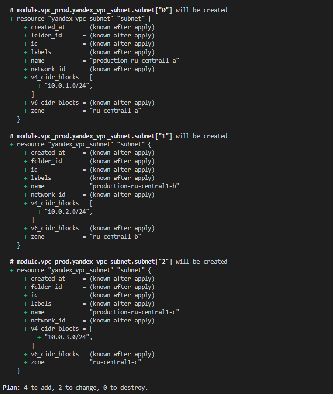
3. После применения всех изменений вид консоли yandex ниже:
   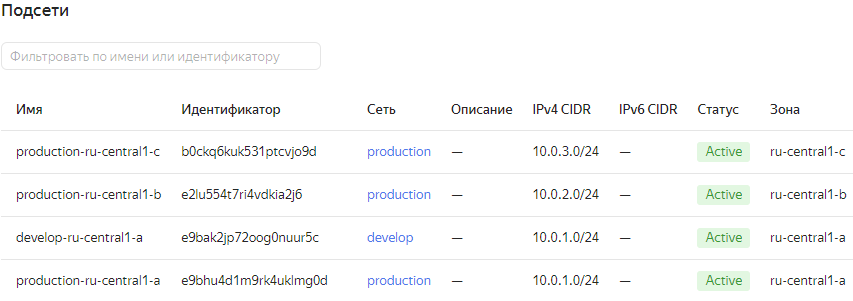