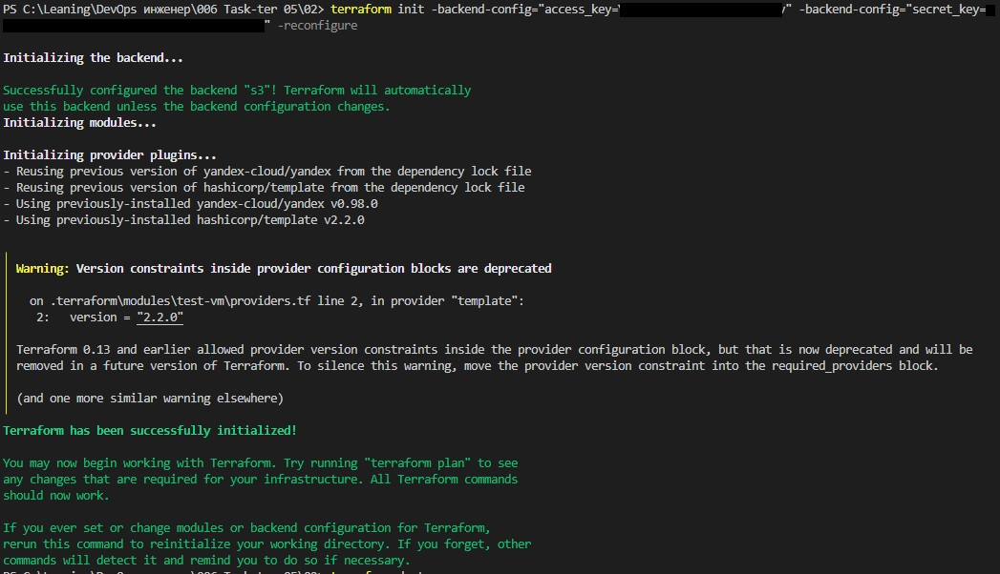
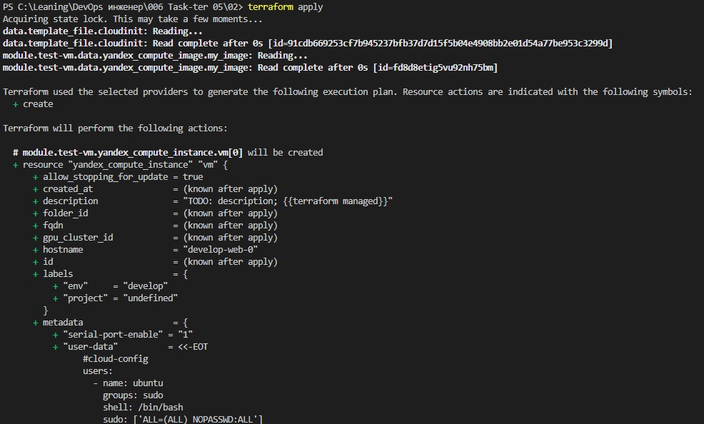
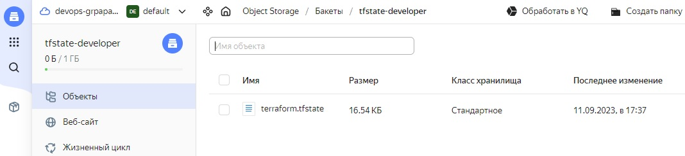
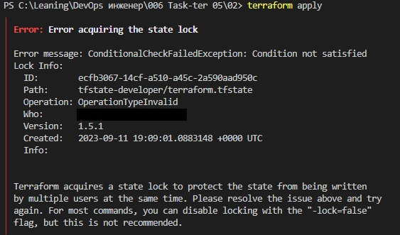
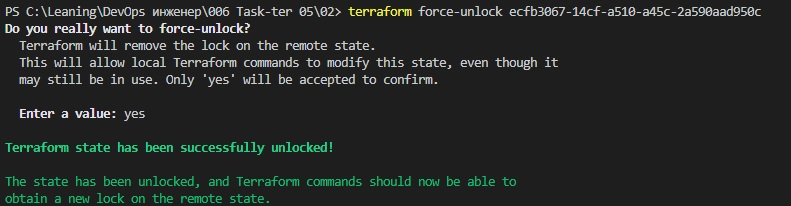

### Задание 1

1. Возьмите код:
- из [ДЗ к лекции 4](https://github.com/netology-code/ter-homeworks/tree/main/04/src),
- из [демо к лекции 4](https://github.com/netology-code/ter-homeworks/tree/main/04/demonstration1).
2. Проверьте код с помощью tflint и checkov. Вам не нужно инициализировать этот проект.
3. Перечислите, какие **типы** ошибок обнаружены в проекте (без дублей).

# Решение 1

Для [ДЗ к лекции 4](https://github.com/netology-code/ter-homeworks/tree/main/04/src):
- Не указана версия yandex-провайдера
- Объявлены, но не используются входные переменные vms_ssh_root_key, vm_web_name, vm_db_name

Для [демо к лекции 4](https://github.com/netology-code/ter-homeworks/tree/main/04/demonstration1):
- На удаленный модуль лучше ссылаться по хешзначению а не по имени ветки или тега, т.к. теги можно переставлять со временем и тем самым возможна подмена кода(Check: CKV_TF_1). 
- Не указана версия провайдера yandex  и template
-  Объявлены, но не используются входные переменные public_key, default_cidr, vpc_name

# Задание 2

1. Возьмите ваш GitHub-репозиторий с **выполненным ДЗ 4** в ветке 'terraform-04' и сделайте из него ветку 'terraform-05'.
2. Повторите демонстрацию лекции: настройте YDB, S3 bucket, yandex service account, права доступа и мигрируйте state проекта в S3 с блокировками. Предоставьте скриншоты процесса в качестве ответа.
3. Закоммитьте в ветку 'terraform-05' все изменения.
4. Откройте в проекте terraform console, а в другом окне из этой же директории попробуйте запустить terraform apply.
5. Пришлите ответ об ошибке доступа к state.
6. Принудительно разблокируйте state. Пришлите команду и вывод.

# Решение 2

1. Создаем бакет:
   - В yc заходим в Object Storage
   - Нажимаем **Новый бакет**
   - Указываем уникальное глобально среди всех бакетов имя. Было указано **tfstate-developer**
   - Указываем предельный бесплатный предел занимаемого пространства - 1Гб
   - Сохраняем
2. Создаем таблицу блокировок
   - Создаем БД ydb. Заходим в **Managed Services for YDB** и нажимаем **Создать базу данных**. Указываем имя БД - **tfstate-develop**. Задаем максимальный бесплатный размер БД - 1Гб
   - В списке БД нажимаем по названию БД и проваливаемся внутрь БД.
   - Выбираем слева пункт меню **Навигация**
   - Нажимаем кнопку **Создать** и в выпадающем списке команд выбираем **Таблица**(можно еще создать Директории и Потоки данных)
   - Задаем название таблицы(например **tfstate-locks**) и выбираем тип таблицы - **Документальная**(в отличие от строковой таблицы каждая запись может иметь свой собственный набор атрибутов, но также имеет уникальный идентификатор)
   - Указываем один столбец - LockID типа строка
   - Сохраняем
3. Создаем сервисный аккаунт
   - На странице каталога создаем новый сервисный аккаунт
   - На странице аккаунта создаем и записываем новый статический ключ доступа(он состоит из access_key и security_key. Они понадобятся при заполнении блока backend)
   - Т.к. права в ydb по умолчанию не наследуются, то не указываем никаких ролей
   - Заходим в **Managed Services for YDB**
   - Выбираем слева пункт **Права доступа** и нажимаем кнопку **Назначить роли**
   - Выбираем созданный аккаунт и назначаем ему роль **ydb.editor**
   - Сохраняем
4. Назначаем акканту права на бакет
   - В списке бакетов нажимаем рядом с бакетом на троеточие и в выпадающем списке выбираем команду **ACL бакета**
   - Появится диалоговое окно где выбираем аккаунт и задаем ему права **Read And Write**
   - Сохраняем

В итоге получаем
1. Команда **terraform init -backend-config="access_key=..." -backend-config="security_key=..."** выводит:
   
2. Команда **terraform apply** выводит:
   
3. В итоге создаются подсети и  ВМ, а также сохраняется в бакете стейт:
   

Если запуска **terraform concole** и параллельно в другом окне пытаемся выполнить **terraform apply**, то получаем блокировку стейта:

Устраняем ошибку командой **terraform force-unlock ecfb3067-14cf-a510-a45c-2a590aad950c**. Результат устранения ошибки ниже:

Аналогичная ошибка также появляется, но без Lock info в случае если не выданы права аккаунту к таблице блокировок в БД ydb, только там дополнительно выдается сообщение **status 400**

# Задание 3  

1. Сделайте в GitHub из ветки 'terraform-05' новую ветку 'terraform-hotfix'.
2. Проверье код с помощью tflint и checkov, исправьте все предупреждения и ошибки в 'terraform-hotfix', сделайте коммит.
3. Откройте новый pull request 'terraform-hotfix' --> 'terraform-05'. 
4. Вставьте в комментарий PR результат анализа tflint и checkov, план изменений инфраструктуры из вывода команды terraform plan.
5. Пришлите ссылку на PR для ревью. Вливать код в 'terraform-05' не нужно.

# Решение 3

